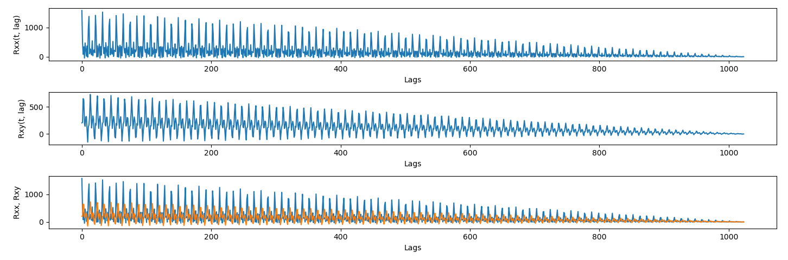

# Lab1.1

## Rxx vs Rxy execution time comparison

```
(venv) D:\Study\University\.VI\RTS\labs\lab1>python -m autocorrelation_12
Rxx time: 0.00032080000000000997, Rxy time: 0.00032599999999993745
```

## Example


